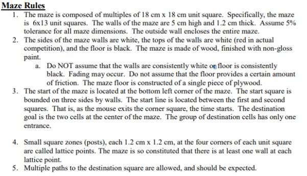
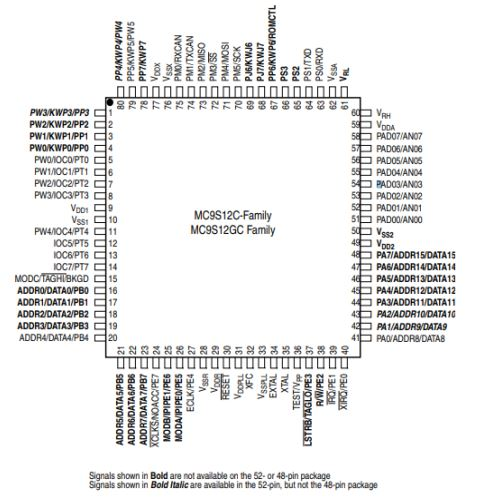
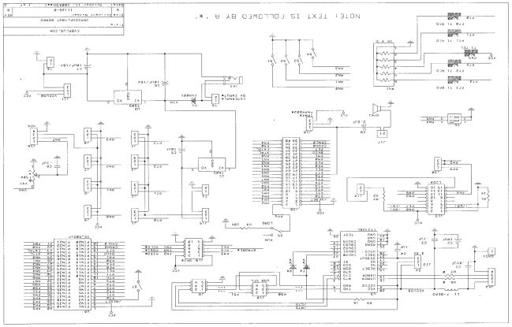

# Micro-controller Maze Solving Mouse

In this project, all algorithms are allowed to be used in the creation of the program processed by the microcontroller (MC912C32) in addition to the Dragonflybot board. Programming will be done with Freescale IDE that enables groups to develop embedded applications on HCS12 systems. The micromouse will solve a 6 x 13 maze with some rules discussed below.

## Problem Statement

The micromouse in 6 x 13 maze is required to reach the center of the maze from bottom left.
Micromouse must be self-contained without any remote controls and shall not damage or destroy the
wall of the maze.



## Mechanical Platform and Electrical Platform

### Discussion : Advantages and Disadvantages

In this project, stepper motor instead of DC motor. DC motors are cheaper and easy to use, however they
are not very accurate and overheat easily when they run too fast compared to stepper motors. Because
the ultimate goal when building micromouse is to solve the maze accurately and fast, these features will
prevent the micromouse from completing the maze in the most optimal manner.

#### Pin-out Diagram showing pins used on HCS12



#### Micromouse Schematic



## Software Platform

### Beans and Methods Used

1. Project.c

   ```
   - void pollSensors() : It polls the sensor values from the micromouse
   - void solveMaze() : Includes all the algorithms and methods to solve the maze for the project, including checking walls, checking left, front, and right, updating the distance values for the map, and checking directions where the micromouse is headed
   - void powerMotors(int powers) : powers motor
   - void steps(int numsteps) : methods for steps
   - void Forward() : move forward
   - void Left() : move left
   - void Right() : move right
   - void Turn() : Turn 180 degrees
   - main() : It runs the solveMaze() with polling the sensors until the maze find  the destination

   ```

2. Event.c
   ```
   - void PID_OnInterrupt() : It implements the PID functions
   - void MotorR_DriveTimer_OnInterrupt() : Driver timer for right motor
   - void MotorL_DriveTimer_OnInterrupt() : Driver timer for left motor
   - void MotorR_DutyTimer_OnInterrupt() : Duty timer for right motor
   - void MotorL_DutyTimer_OnInterrupt() : Duty timer for left motor
   ```

## Key Function Descriptions

The micromouse implements the algorithm where it finds the shortest distance left from the goal. The
distance array is initially defined in the code and the code modifies the array by adding 4 to the place it
went. This prevents the micromouse from going back in the path it already went. The micromouse
updates wall values and uses the shortest distance available until it finds the goal.

Functions that control the motors, sensors, timers, and interrupts are all required in order to
implementate this algorithm. These auxiliary functions are used within the solve maze method
algorithm explained above.

### Motor Control

Controlling motors in this project was very important for this project because it is the base
function that needs to be used while solving the maze. In order to control the motor, functions
such as power Motors that turns on the power, the steps function that is used for moving the
micromouse forward, right, left, and turn around functions are used in the project.

```c

//Motor Methods
void powerMotors(int power){
   if(power==1){
    MotorR_EN_PutVal(1);
    MotorL_EN_PutVal(0x03);
    Cpu_Delay100US(40);//delay 4ms
   }else{
    MotorR_EN_PutVal(0);
    MotorL_EN_PutVal(0);
    Cpu_Delay100US(40);//delay 4ms
   }
}

void steps(int numsteps){
    int i=0;
    powerMotors(1);
    for(i=0; i<numsteps; i++){
     motorR=(motorR+1)%8;
     motorL--;
     if(motorL<0) motorL=7;
     Cpu_Delay100US(40);//delay 4ms
    }
    powerMotors(0);
}
```

[code 1] powerMotors and steps method

```c
void Forward(void) {
    powerMotors(1);
    stepsL=-367;
    stepsR=367;
    while(stepsR != 0 && stepsL != 0) {

    }
    powerMotors(0);
}

void Right(void) {
    powerMotors(1);
    stepsL=-200;
    stepsR=-200;
    while(stepsR != 0 && stepsL != 0) {

    }
    powerMotors(0);
}

void Left(void) {
    powerMotors(1);
    stepsL=200;
    stepsR=200;
    while(stepsR != 0 && stepsL != 0) {

    }
    powerMotors(0);
}

void Turn(void) {
    powerMotors(1);
    stepsL=400;
    stepsR=400;
    while(stepsR != 0 && stepsL != 0) {

    }
    powerMotors(0);
}

```

[code 2] Motor direction methods

### Sensors

pollSensors() is a crucial function for this project. It detects the distance of the wall that allows
the mouse to know where the walls are located in the maze. This is important so the
micromouse does not collide with the wall and finds the right direction.

```c
void pollSensors(){
    Sensor_Measure(1);
    Sensor_GetValue8(sensors);
}
```

[code 3] pollSensors

### Timer and Interrupt

In event.c, timers for motor such as left and right motor drive timer and duty timer are also
used.
When a timer interrupt occurs, MotorL_DriveTimer_OnInterrupt and
motorR_DriveTimer_OnInterrupt are called only when the interrupt event is enabled

```c
void MotorR_DriveTimer_OnInterrupt(void)
{
    /*
** ===================================================================
**     Event       :  MotorR_DriveTimer_OnInterrupt (module Events)
**
**     Component   :  MotorR_DriveTimer [TimerInt]
**     Description :
**         When a timer interrupt occurs this event is called (only
**         when the component is enabled - <Enable> and the events are
**         enabled - <EnableEvent>). This event is enabled only if a
**         <interrupt service/event> is enabled.
**     Parameters  : None
**     Returns     : Nothing
** ===================================================================
*/

  if (stepsR > 0) {
     motorR=(motorR+1)%8;
     stepsR--;
  } else if (stepsR < 0) {
     motorR--;
     if(motorR<0) motorR=7;
     stepsR++;
  }

}

/*
** ===================================================================
**     Event       :  MotorL_DriveTimer_OnInterrupt (module Events)
**
**     Component   :  MotorL_DriveTimer [TimerInt]
**     Description :
**         When a timer interrupt occurs this event is called (only
**         when the component is enabled - <Enable> and the events are
**         enabled - <EnableEvent>). This event is enabled only if a
**         <interrupt service/event> is enabled.
**     Parameters  : None
**     Returns     : Nothing
** ===================================================================
*/
void MotorL_DriveTimer_OnInterrupt(void)
{
  /* Write your code here ... */

  if (stepsL > 0) {
     motorL=(motorL+1)%8;
     stepsL--;
  } else if (stepsL < 0) {
     motorL--;
     if(motorL<0) motorL=7;
     stepsL++;
  }

}
```

[Code4] DriveTimer_OnInterrupt

When a timer interrupt occurs, dutytimer_oninterrupt is called only if the interrupt event is
enabled.

```c
/*
** ===================================================================
**     Event       :  MotorR_DutyTimer_OnInterrupt (module Events)
**
**     Component   :  MotorR_DutyTimer [TimerInt]
**     Description :
**         When a timer interrupt occurs this event is called (only
**         when the component is enabled - <Enable> and the events are
**         enabled - <EnableEvent>). This event is enabled only if a
**         <interrupt service/event> is enabled.
**     Parameters  : None
**     Returns     : Nothing
** ===================================================================
*/
void MotorR_DutyTimer_OnInterrupt(void)
{
  /* Write your code here ... */

  if(toggle2){
    MotorR_WriteBits(0);
    toggle2=0;
 } else{
      MotorR_WriteBits(motorSeq[motorR]);
      toggle2=1;
 }

}

/*
** ===================================================================
**     Event       :  MotorL_DutyTimer_OnInterrupt (module Events)
**
**     Component   :  MotorL_DutyTimer [TimerInt]
**     Description :
**         When a timer interrupt occurs this event is called (only
**         when the component is enabled - <Enable> and the events are
**         enabled - <EnableEvent>). This event is enabled only if a
**         <interrupt service/event> is enabled.
**     Parameters  : None
**     Returns     : Nothing
** ===================================================================
*/
void MotorL_DutyTimer_OnInterrupt(void)
{
  /* Write your code here ... */

  if(toggle1){
    MotorL_WriteBits(0);
    toggle1=0;
 } else{
      MotorL_WriteBits(motorSeq[motorL]);
      toggle1=1;
 }

}

```

[Code5]DutyTimer_OnInterrupt

### PID Interrupt

PID interrupt helps the mouse to not collide with the wall by having timer interrupts when the
this interrupt is called.

```c
void PID_OnInterrupt(void)
{
  //int k = 20;   //change later
  //int left = sensors[0];
  //int right = sensors[2];
  //int error = (left-right)/2;
  //MotorR_DriveTimer_SetPeriodUS(4000+k*error);
  //MotorL_DriveTimer_SetPeriodUS(4000-k*error) ;

  int k = 30; //some value you fine tune
  int ki = 3;
  int left = sensors[0];
  int right = sensors[2];
  int error = (left - right) / 2;
  if(abs(error) > 20) {
   k = 0;
   ki = 0;
  }
  else if(abs(error < 200))
  {
    k = 0;
   ki = 0;
  }
  integral = integral + error;
  MotorR_DriveTimer_SetPeriodUS(4000 + (error * k) + (integral * ki));
  MotorL_DriveTimer_SetPeriodUS(4000 - (error * k) - (integral * ki));
  if (left == right) {
    integral = 0;
  }

}
```

[Code6] PID_OnInterrupt

### Check Walls

After changing the micromouse orientation value relative to the north, it checks for the wall.
Below is checking left walls. If the wall is detected, it modifies the distance to the goal
accordingly and updates the array that contains wall values stored in the map. This is implemented for front and right as well.

```c
//Check Walls
     //check left
     if(sensors[0] > 80)
     {

       int placeLeft = place;
       placeLeft = place - 1;

       if(placeLeft < 0) {
       //was 4 I think this would have caused array index outofbounds
       placeLeft = 3;
       }

       maze[mouseX][mouseY][placeLeft] = 1;

     }
```

[Code7] Check Left

### Making Decisions for next step

The algorithm first checks where the direction is then check where the micromouse is physical
heading. For example, if it is moving east and pointing north, it will turn right and go forward to
move east. Else if it is already heading east, it will go forward and the same for other directions.

```c
//if east move
    if(direction[1] == 1)
    {
            //if pointing north
           if(heading[0] == 1)
           {
            Right();
            Forward();
           }
           else if(heading[1] == 1)
           {
               // if already pointing east
               Forward();
           }
           else if(heading[2] == 1)
           {
               //if pointing south
               Left();
               Forward();
           }
           else
           {
                //if pointing west
                Turn();
                Forward();
           }

           mouseX++;
           //Need to modify the heading array
           heading[0] = 0;
           heading[1] = 1;
           heading[2] = 0;
           heading[3] = 0;

    }
```

[Code8] move east

## Testing

Testing for this project first required many debugging sessions to fix the errors with the code. After the
code ran without problem, while observing how the micromouse worked in the maze, many
optimizations had to occur. PID functions were very inconsistent during the first implementation, the
micromouse collided with the wall. This issue was fixed by implementing integration into the control
scheme. Another behavior that had to be troubleshooted was where it first stuck in an infinite loop of
going back and forth between the goals but by including the position of the goal in the main method the
problem was solved.

## Results

Micromouse solved the maze correctly. The result code is included in this repository.

## Conclusion

With this lab, the group learned about creating an algorithm that solves a maze with a micromouse
where the group can implement sensors, motors, and interrupts. With implementing the algorithm, we
could think deeply about how the motors had to be moved in order to make the correct decision with
pid values and recognizing walls with the sensors. Having more working mice, or assigning a mouse per
each group could help with the project in the future. We issues that were the result of switching back
and forth between mice.
